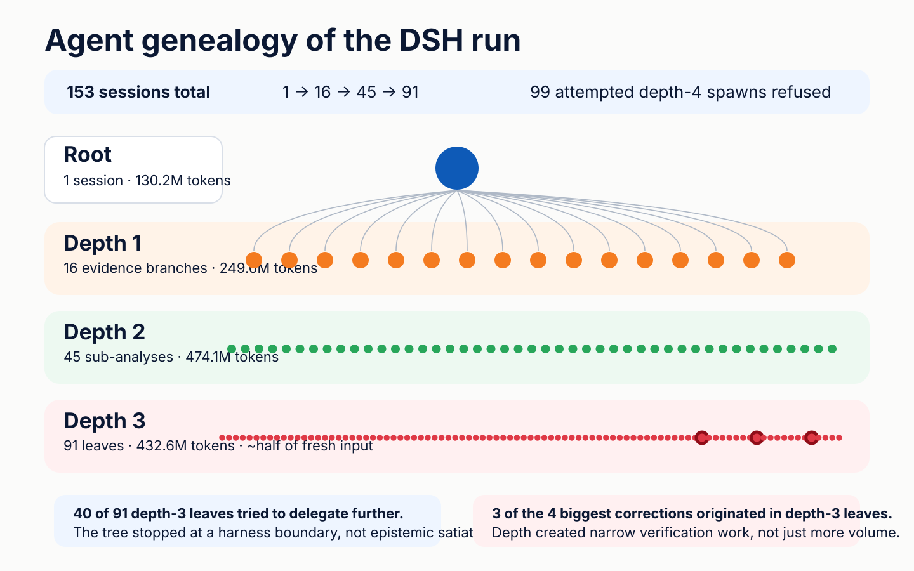
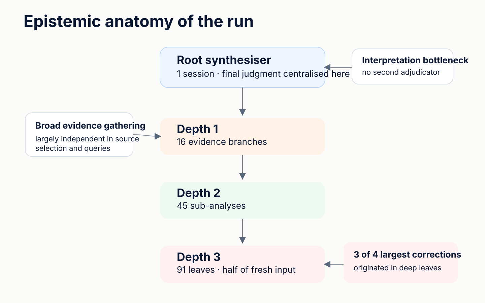
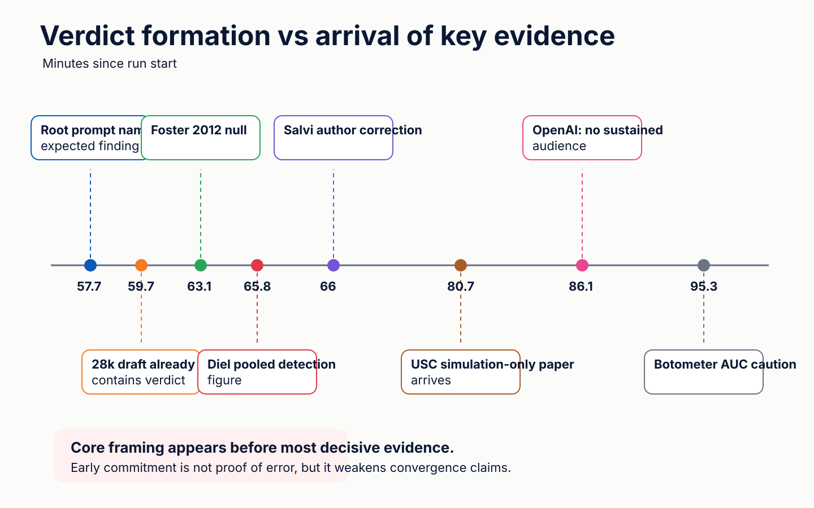
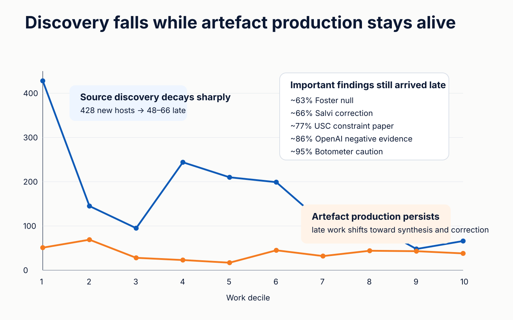
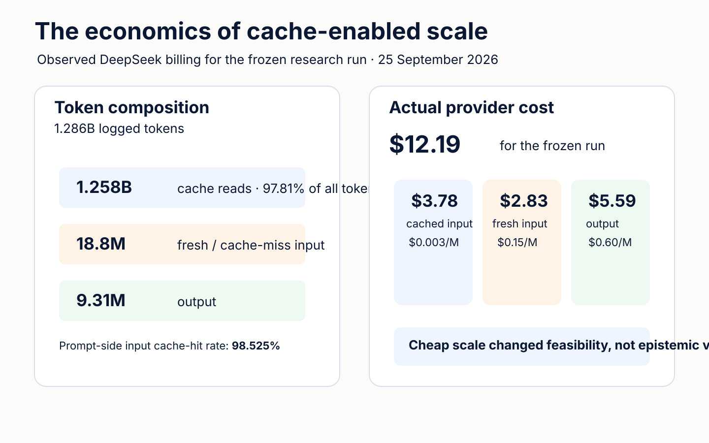

# What 153 agents actually bought us

## Lessons from a 1.28-billion-token recursive research run

*Practitioner report — working draft*

**Leon R. van Bokhorst**  
Research Group IxD · Fontys University of Applied Sciences

> **Start here**  
> **Original research artefact:** [`leonvanbokhorst/deep-research`](https://github.com/leonvanbokhorst/deep-research) — what the agents researched and concluded.  
> **Process analysis and this report:** [`leonvanbokhorst/deep-research-log-analysis`](https://github.com/leonvanbokhorst/deep-research-log-analysis) — what the 153-agent process actually did.  
> The analysed research artefact is frozen at [`deep-research@33ca23b`](https://github.com/leonvanbokhorst/deep-research/commit/33ca23b474a11b5ee90563a9f59ed002de485abd).

**Suggested citation:** van Bokhorst, L. R. (2026). *What 153 agents actually bought us: Lessons from a 1.28-billion-token recursive research run.* Research Group IxD, Fontys University of Applied Sciences.

---

We did not set out to run an experiment on recursive research. We were using DSH to do research, and the work simply became large enough that the process itself started to become interesting.

The task was genuinely open-ended. We were investigating two related questions, delegating parts of them to specialist agents, asking those agents to retrieve evidence and challenge weak claims, and then pulling the result back together into something a human could actually use. The run grew to **153 sessions, 10,037 model steps, 16,195 tool calls and 1.286 billion logged tokens** over roughly 96 minutes of wall-clock time.

At first the scale was impressive for the obvious reason: it produced a lot. The research workspace filled up with source captures, findings briefs, notes, scripts and revisions. The final reports looked unusually well-supported for something produced so quickly.

Then we exported the full session tree and treated the run itself as data.

That changed the interesting question. Instead of asking whether a 153-agent system could produce a substantial report, we wanted to know **what the recursion had actually contributed**. Had the agents found genuinely different evidence, or mostly repeated each other? Did deeper delegation improve checking? Did agreement mean independent convergence? When did the run stop learning new things? How much of the apparent scale was made possible by caching? And perhaps most importantly: what kinds of error did the architecture notice, and what kinds did it leave alone?

The answers were mixed in a way we did not anticipate. The agents gathered evidence with surprisingly little overlap. Deep leaves corrected claims their parents had already accepted. Several important findings only appeared late, after general source discovery had begun to flatten. At the same time, the final synthesis overstated how independently its central conclusion had emerged. The system developed a fairly effective distributed mechanism for checking facts, while final interpretation remained concentrated in one synthesiser.

This report is therefore not a benchmark and not an argument that “153 agents are better than one”. It is a forensic practitioner case: one unusually well-traced recursive research run, inspected closely enough to see where scale helped, where it did not, and what we would redesign next time.

The two questions that guide the report are simple: **what did all that recursive scale actually buy us, and when does more research become more knowledge rather than merely more confidence?**

---

## 1. What we analysed

The original research happened in one DSH root session with recursive delegation enabled to a maximum depth of three. The root remained the sole final synthesiser. Under it sat **16 depth-1 branches, 45 depth-2 analyses and 91 depth-3 leaves**, giving 153 sessions in total ([genealogy reconstruction](analysis/02-agent-genealogy.md)).

The exported trace is unusually rich for this kind of work. It contains the delegation tree, exact sub-agent prompts, model usage, tool calls and results, inter-agent messages, timestamps, file operations and the research workspace produced during the run. We preserved the corpus rather than cleaning it up after the fact: the 153 session files are pinned individually by SHA-256 in the [corpus manifest](analysis/data/manifest.json), and all derived tables can be regenerated from read-only analysis scripts in this repository ([schema and reconstruction notes](analysis/01-corpus-manifest-and-schema.md)).

That matters because much of what follows is not visible from the final report alone. A polished synthesis hides the order in which evidence arrived, which branch first wrote a claim, whether a correction travelled upward, and whether two apparently independent findings actually share an ancestor. The session trace lets us reconstruct those things.

We did **not** use the process analysis to decide whether every substantive claim in the original threat research was true. That would be another research project. Here the object is the research process itself: what the system searched, delegated, corrected, retained and claimed about its own work.

The run is also not one continuous 96-minute burst. There is a roughly **33-minute idle gap** between the two research questions. Active work is therefore closer to 63 minutes. We keep the 96-minute wall-clock span because it describes the exported session, but we avoid turning it into a productivity statistic.

*Figure 1. Agent genealogy of the DSH run. The tree is structurally broad, but its bottom edge is censored by the hard depth cap rather than a natural stopping condition.*

---

## 2. Scale bought breadth

One of our initial suspicions was that recursive fan-out might mostly manufacture duplication: many agents searching for similar terms, landing on the same handful of sources and then summarising each other. At this scale, that would still look impressive in a file tree while adding little epistemically.

The trace showed something quite different. Across the 16 depth-1 branches, the median pairwise domain overlap was only **0.031**. The branches collectively reached **1,609 distinct evidence hosts**. Their host counts summed to 2,400, an overlap factor of only 1.49×. At the query level the pattern was even clearer: only **1.9% of 2,416 normalised unique queries** were repeated across sessions ([synthesis §2.1](analysis/00-synthesis.md#21-genuine-broad-non-overlapping-evidence-gathering)).

So the fan-out was not mainly many copies of the same search. Different branches really did explore different parts of the evidence space.

That breadth mattered because several important negative findings were independently encountered from different directions. Different agents reached the same primary material through different queries, while many other sources remained branch-specific. This is a stronger result than “the agents wrote lots of notes”. It means the architecture created something close to parallel investigative coverage.

There is a caveat. The branches were not independent in every sense. When DSH's first-class web search repeatedly failed, agents created shared shell tooling and told each other about it. Scripts such as `tools/news.sh` and `tools/get.sh` became common infrastructure used across many branches. The genealogy therefore looks more independent than the retrieval substrate actually was. A bug in one of those shared scripts could have affected multiple branches at once.

That hidden coupling is useful to notice because “different agents” is not the same thing as “independent evidence channels”. Independence has layers: prompts, source selection, tools, framing and final adjudication can each be shared or separate.

Still, on the question we could actually measure well, the result was clear: **recursive scale bought substantial search breadth with much less duplication than we expected**.

---

## 3. Depth behaved like peer review

The most encouraging finding did not come from breadth alone. It came from what happened at the bottom of the tree.

Three of the four largest corrections in the run originated in **depth-3 leaves**. These were not style edits or minor citation cleanups. In each case, a narrow specialist went closer to a primary source and found that a stronger claim higher in the tree did not survive the check.

One agent retrieved Foster et al. (2012) and found that the relevant effect was driven by **repetition rather than the number of independent sources**, undermining a claimed amplification mechanism. Another found a recent **author correction** that retired a persuasion effect size already circulating through the research. A third searched a full text through the Internet Archive and returned no support for a quotation that had already been attributed to Liddell Hart.

The pattern is worth dwelling on. Parent branches often had the broader conceptual task: establish the landscape, connect literatures, identify a plausible mechanism. A deeper child was more likely to receive a narrow question such as “verify this figure”, “find the primary source”, or “check whether this quotation is actually there”. That narrower mandate created enough attention to challenge material the broader branch had already treated as usable.

Across the run we reconstructed roughly twenty corrections. Most were deflationary: they removed overstatement, weakened an attribution, downgraded a source, or reduced confidence. Only a small minority pushed in the opposite direction ([correction forensics](analysis/notes/corrections.md)).

That is not what we expected recursion to be best at. We initially thought of delegation mainly as a way to increase coverage. Instead, depth sometimes created a crude form of **peer review by task decomposition**. No agent was formally appointed as Reviewer 2. The review behaviour emerged because narrow descendants re-opened claims that their ancestors had already compressed into a narrative.

This also changes how we think about the value of agent count. The useful mechanism was not voting or consensus. It was the chance that some branch would approach the same issue with a different, narrower verification task.

A compact way of saying it is: **the value of fan-out was adversarial coverage, not consensus**.

*Figure 2. Epistemic anatomy of the run. Evidence gathering and verification spread through the tree, while final interpretation remained concentrated in the root synthesiser.*

---

## 4. Evidence spread, judgment didn't

The most uncomfortable finding started with one sentence in the final research report: **“six independent evidence streams converged”** on the formulation *plausible, novel, and currently unobserved*.

That sentence sounded reassuring. It implied that several independent routes through the evidence had reached the same conclusion.

The [provenance trace](analysis/05-independence-and-convergence.md) told a different story.

The “six streams” were six sibling sub-agents created by one depth-1 branch. One depth-2 agent inside that branch was the first place where the exact phrase *plausible, novel, and currently unobserved* appeared. Shortly afterwards the branch reported convergence upward and the root imported that language into the final report.

The more important part is temporal. The root had already written a substantial draft containing the central framing at about **+59.7 minutes**. Several of the findings later presented as decisive support arrived after that. The Foster null appeared around +63 minutes, the Salvi correction around +66, the USC paper that the report itself later called the “single most important constraint finding” around **+80.7**, OpenAI's strongest negative evidence around +86, and the Botometer caution around +95.

None of this proves the conclusion was wrong. It may still be the best interpretation of the evidence. Nor does it mean the later research was fake or merely decorative: we can see that the branches gathered genuinely different sources and contradicted each other on many factual claims.

What the trace does show is that the conclusion was not produced by six independent judgments converging from scratch. A better description is that **a prior was stated early, independent evidence gathering followed, and much of the later evidence turned out to be consistent with that prior**.

That is a meaningful difference. Independent search can strengthen a conclusion without independently generating it. When a system describes those two things as the same process, it overstates the epistemic independence of its result.

This became the central distinction in the whole analysis: **independent evidence gathering is not independent judgment**.

*Figure 3. Verdict formation versus the arrival of key evidence. The timing does not make the early framing wrong; it does make later claims of independent convergence harder to sustain.*

---

## 5. Facts had reviewers. Framing didn't.

Once we had separated evidence independence from judgment independence, another asymmetry became easier to see.

The run was quite willing to correct **checkable factual claims**. We found disagreements over dates, quotations, publication details, dollar figures, effect sizes and source attributions. In thirteen documented cases, one part of the tree successfully corrected another.

The one disagreement that clearly touched the interpretive core behaved differently. A specialist agent judged “reflexive control” only a **partial** conceptual fit and explained why: the source tradition was human-decision-centric, deliberate and state-centric, while the emerging argument was about AI-enabled, potentially self-amplifying processes. The branch lead explicitly recorded that it had **kept the rating high**, which matched the framing already present in the draft.

One case is not enough to claim that recursive systems always defend framing while correcting facts. But architecturally the pattern makes sense. There were many agents capable of checking pieces of evidence. There was only one final place where those pieces were turned into meaning.

The root synthesiser therefore played two roles at once. It integrated the evidence, and it adjudicated what the evidence meant. That concentration is efficient: without it the result might never become a coherent report. It is also an obvious bottleneck if the synthesiser's framing needs to be challenged.

This is why the phrase **“breadth decentralised, verification distributed, judgment centralised”** feels like more than a slogan. It describes the actual architecture of this run.

The design implication is not that synthesis should be decentralised completely. A report eventually needs an authorial position. The implication is that interpretive review probably deserves its **own** independence, rather than assuming that factual diversity automatically supplies it.

---

## 6. Finding errors, missing fixes

A second weakness appeared after the system had already done something right: it found errors that were not fully repaired in the final artefact.

At least two claims were explicitly withdrawn or weakened in one part of the report while surviving elsewhere under their original wording ([anomaly and correction analysis](analysis/06-anomalies-and-unexpected-behaviour.md)). The final verification pass helps explain why. It searched for known bad strings and named claims. That is effective when the problem is a distinctive quotation or citation. It is much less effective when the same idea survives semantically in a differently worded paragraph.

Correction latency compounded the problem. Some warnings moved up the tree quickly; others took many minutes. One important correction took more than sixteen minutes to reach the root. During that interval, thousands of other model steps continued across the system.

At this scale, the bottleneck was no longer simply **finding** an error. It was moving that correction to the one context that could apply it, identifying every affected passage, and confirming that the correction had actually propagated.

The run treated corrections mostly as messages. A useful next architecture would treat them as **stateful objects**. A correction could identify the challenged claim, the supporting primary source, the sessions or artefacts likely to be affected, and whether each downstream occurrence had been reconsidered. In software terms, this starts looking less like a chat message and more like an issue that stays open until resolved.

That sounds procedural, but it is an epistemic design problem. A research system that can discover its mistakes but cannot reliably update its own synthesis is only halfway corrigible.

There was an additional irony here. Some of the least well-verified claims in the run were the system's claims about **its own process**: how many independent streams had converged, how many corrections it had made, and why the recursion had stopped. No dedicated branch was checking those statements. The system was much better at verifying the world than at verifying its narration of itself.

That may be one of the most reusable lessons from the case: **process claims should be subjected to the same verification discipline as domain claims**.

---

## 7. The tree stopped at a fence

The final genealogy has 91 leaves at depth 3. It is tempting to read that shape as a natural endpoint: the research decomposed until the questions became small enough, then the leaves returned their findings.

The trace makes that interpretation impossible.

**Forty of the 91 depth-3 sessions attempted to delegate further.** Together they made **99 depth-4 spawn attempts**, each with a fully written prompt. Every one was rejected by the harness because `maxDepth=3` ([depth-cap reconstruction](analysis/06-anomalies-and-unexpected-behaviour.md#a1--recursion-was-terminated-by-a-hard-cap-not-by-diminishing-returns)).

So the tree was censored by infrastructure. It did not naturally decide that further delegation had no value.

This matters for two reasons. First, tree shape is partly a property of the harness configuration, not just of the problem. A depth histogram can look like a property of “how research decomposes” while actually reflecting an arbitrary fence.

Second, recursive systems have no obvious internal notion of epistemic satiation. Many agents could always imagine another useful sub-question. Without a budget, depth limit, time limit or explicit stopping mechanism, the process might simply continue generating plausible work.

The max-depth setting was therefore both epistemically crude and operationally useful. It stopped the run predictably. We would keep some kind of hard budget next time, but we would be more careful not to interpret that boundary as evidence that the research itself had reached a natural end.

Or less formally: the creature had not reached epistemic satiation. We put up a fence.

---

## 8. Stopping was the harder problem

The run contains a very clear diminishing-return signal. General source discovery falls sharply over time. The first tenth of model work found **428 new evidence hosts**. The final two tenths found only **48** and **66**.

If new-source rate were the only thing that mattered, this would suggest a straightforward stopping rule.

But the rest of the trace refuses to cooperate. Artefact production stayed comparatively steady late in the run, with roughly 38–45 new artefacts per decile. More importantly, several of the **best corrections and strongest negative findings arrived late**. The Foster null first appeared at roughly 63% of the work, the Salvi correction around 66%, the USC constraint paper around 77%, OpenAI's strongest negative evidence around 86%, and the Botometer caution around 95%.

A stopping rule based on “we are not finding many new domains anymore” would therefore have removed a disproportionate amount of the work that made the final report more cautious and better grounded.

A rule based on **conclusion stability** would have been worse. The central conclusion stabilised early, before much of the evidence later used to justify it arrived. In this run, stable judgment was partly a sign of early commitment, not epistemic maturity.

The late phase was therefore not simply “low value”. It was **high variance**. It contained both some of the strongest corrections and a lot of churn: repeated synthesis, document bookkeeping, additional delegation attempts that hit the depth cap, and new artefacts built from an increasingly familiar source pool.

The best discriminator we could find was narrower than general novelty. Valuable late work disproportionately involved **new primary sources**: original papers, author corrections, full-text archives and direct institutional documents. Less valuable late work more often revisited already familiar material.

That does not yet give us a clean stopping algorithm. “Primary source” itself needs classification, and one new primary document can be trivial while another overturns a whole section. But it does give us a better live question: **is the system still reaching new primary evidence, or is it mostly rearranging what it already knows?**

*Figure 4. General source discovery decays while artefact production stays active. Several high-value corrections and negative findings still arrived late, making stopping a high-variance problem rather than a simple diminishing-return threshold ([full stopping analysis](analysis/07-marginal-return-and-stopping.md)).*

---

## 9. Messages mattered more than files

One methodological surprise is worth pulling out because it changes how we would instrument similar systems.

If we had measured contribution only through files, many agents would have appeared useless. A file-based analysis initially made a large fraction of presented deliverables look “orphaned”: written by an agent but never subsequently read.

That was misleading.

The dominant transfer channel was **agent-to-agent messaging**. The trace contains 374 genuine inter-agent messages carrying about 1.65 million characters. Once those messages are included, **152 of 153 sessions produced output that reached another session** ([message-channel analysis](analysis/06-anomalies-and-unexpected-behaviour.md#a2--the-dominant-transfer-channel-was-messages-not-files)).

This matters for evaluation. In recursive research, contribution is not equivalent to “file created and later opened”. A useful agent may send a compact correction, a URL, a warning or a synthesis directly upward without leaving a durable artefact that another agent reads from disk.

It also matters for provenance. Messages are fast and convenient, but they make information flow less visible than file inheritance. A future harness intended for serious research should probably make important claim transfer more structured: source, claim, confidence, correction status and provenance could travel together rather than as prose that must later be reconstructed.

The broader lesson is mundane but important: **instrument the channels the system actually uses, not the channels we expect it to use**.

---

## 10. What cheap scale changes

The run's logical input volume was **1.277 billion tokens**. Only **18.8 million** of those were cache misses.

Initially we could only describe that architecture in token terms because the DSH export does not contain provider pricing. Later we obtained the same-day DeepSeek Platform billing export and a separate four-session DSH analysis export. That second run gave us a remarkably clean validation: it contained exactly **398 model calls**, and DeepSeek's 12:00–13:00 billing bucket also contained exactly 398 requests, with identical cache-hit, cache-miss and output-token totals.

That lets us use the provider's actual historical prices with confidence for this case. The frozen 153-session research run reconstructs to approximately **$12.19**: about **$3.78** for cached input, **$2.83** for fresh input and **$5.59** for output ([provider reconciliation](analysis/08-provider-billing-reconciliation.md)).

The important claim is not that “a billion tokens costs twelve dollars”. It plainly does not in general. The claim is narrower and more interesting: **this particular architecture, model, shared-prefix structure and provider pricing made enormous logical context reuse extremely cheap**.

That changes the design space for recursive agents. A branch can inherit a large hot prefix, do some fresh work and repeatedly re-read its growing context without each logical token being billed at the fresh-input rate. Fan-out becomes economically plausible at a scale that would otherwise look absurd.

But the same mechanism also lowers the cost of low-value activity. Re-reading context, re-synthesising the same evidence and polishing another version of a report can all become nearly frictionless. Cheap computation does not distinguish useful verification from epistemic bureaucracy.

So cache efficiency is best understood as a **feasibility condition**, not as evidence that the resulting scale was worthwhile. The trace still has to tell us what that scale bought.

*Figure 5. Token and cost composition. Cache-enabled reuse made the logical scale economically feasible; it did not determine whether the work was epistemically valuable.*

---

## 11. What we'd change next time

We would not respond to this case by simply making the tree smaller. The broad search and deep verification were two of the strongest parts of the run. The redesign should preserve those benefits while moving independence into places where this architecture lacked it.

The first change would be a **second adjudication pass that does not inherit the synthesiser's framing**. This is different from adding another evidence-gathering branch. The reviewer would see the evidence and perhaps the synthesis, but would be explicitly asked to reconstruct plausible interpretations, identify where evidence has been turned into stronger language than it supports, and challenge the organising frame itself.

We would also make **interpretive dissent an explicit task**. Current sub-agents often challenged factual details because their prompts asked them to verify sources or examine a narrow claim. Very few were asked, in effect, “what if the framing that organises these facts is wrong?” That question deserves its own branch rather than hoping it emerges accidentally.

Corrections should become **first-class, trackable objects** rather than prose messages. A correction should remain open until affected passages have been revisited. That would make correction propagation observable during the run instead of something we can only reconstruct afterwards.

We would instrument **primary-source novelty** as a live signal. It should not automatically stop or continue the run, but it could help distinguish “we are still reaching new evidence” from “we are generating more structure around an exhausted source pool”. Combined with a correction queue and a hard budget, that seems more promising than waiting for agent agreement.

Finally, we would explicitly verify **process claims**. If the final system wants to say that six streams independently converged, that eight claims were corrected, or that the tree stopped because returns had diminished, those claims should be checked against the trace before publication. In this run, some of the most overstated statements were about the research process itself.

The design direction is therefore not “more recursion”. It is **different kinds of independence at different stages**: broad delegation for discovery, narrow delegation for verification, independent review for interpretation, and explicit state for correction.

---

## 12. What this case supports

This is one run, and the details matter. It used one harness, one provider/model configuration, one maximum recursion depth, one final synthesiser and two related research questions. The research topic itself encouraged source checking and sceptical evidence handling. Another domain could behave differently.

We cannot infer that depth 3 is optimal, that 153 sessions is a sensible default, or that a similar system on another provider would have the same economics. We also cannot turn one observed asymmetry between factual correction and interpretive correction into a universal claim about agent systems.

What we can support is more modest and, for practice, more useful. In this run, recursive delegation produced broad, relatively non-redundant evidence gathering. Deep descendants sometimes discovered corrections that shallower branches missed. Final interpretation remained structurally centralised despite that distributed evidence work. General source novelty decayed before high-value corrective work stopped. And provider-side caching made the entire scale economically feasible at surprisingly low cost.

The case is unusually inspectable. The complete session tree is pinned file-by-file, the derived data and scripts are in the repository, and the provider accounting has been independently reconciled against a separate frozen run. The cross-repository boundary is recorded in a [machine-readable provenance record](analysis/data/case-study-provenance.json). That does not make the conclusions general. It makes the path from trace to claim inspectable.

We think **forensic case study** is the right description. It is close enough to practice to retain the mess, but structured enough that other builders can check where our conclusions came from.

---

## 13. What we take forward

The headline is not that 153 agents beat one agent. That comparison was never run, and it would flatten the interesting part of the case anyway.

What the trace shows is that different epistemic functions scaled differently. **Breadth scaled well. Verification scaled surprisingly well. Judgment did not decentralise merely because evidence gathering did.**

The same early commitment that helped one synthesiser turn an enormous amount of material into a coherent report also weakened the independence of the final interpretation. That is not simply a failure. Coherence requires selection and framing. The practical problem is to preserve that coherence while giving the framing itself somewhere to be challenged.

The next system we want to build is therefore not one that merely spawns more agents. It is one that knows the difference between **searching broadly, checking narrowly, correcting reliably and judging independently**.

That feels like the more useful lesson from 1.28 billion tokens:

> **Recursive scale made it easier to know more. It did not automatically make it easier to know whether our interpretation was right.**

---

## Evidence and reproducibility

This practitioner report is a human-facing synthesis of the forensic analysis in this repository. It deliberately leaves the detailed tables, reconstruction notes and event-level argumentation in the technical reports rather than reproducing them here.

The main supporting documents are:

- [`analysis/00-synthesis.md`](analysis/00-synthesis.md)
- [`analysis/02-agent-genealogy.md`](analysis/02-agent-genealogy.md)
- [`analysis/03-token-and-cache-tables.md`](analysis/03-token-and-cache-tables.md)
- [`analysis/05-independence-and-convergence.md`](analysis/05-independence-and-convergence.md)
- [`analysis/06-anomalies-and-unexpected-behaviour.md`](analysis/06-anomalies-and-unexpected-behaviour.md)
- [`analysis/07-marginal-return-and-stopping.md`](analysis/07-marginal-return-and-stopping.md)
- [`analysis/08-provider-billing-reconciliation.md`](analysis/08-provider-billing-reconciliation.md)

The original substantive research is frozen at
[`leonvanbokhorst/deep-research@33ca23b`](https://github.com/leonvanbokhorst/deep-research/commit/33ca23b474a11b5ee90563a9f59ed002de485abd).
